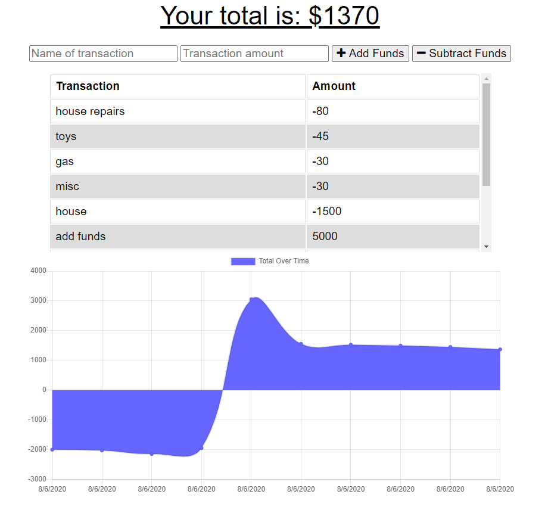

# 18_budget-tracker

## Project Description
For this assigment, we are tasked to add functionality to our existing Budget Tracker application to allow for offline access and functionality.

## Acceptance Criteria
GIVEN a user is on Budget App without an internet connection
WHEN the user inputs a withdrawal or deposit
THEN that will be shown on the page, and added to their transaction history when their connection is back online.

## Offline Functionality
Users should be able to:
* Enter deposits online
* Enter expense offline
When brought back online:
* Offline entries should be added to tracker

## Visual

